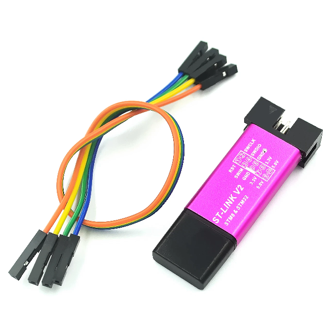

<!-- 
Copyright Jacques Deschênes, 2021
Ce document fait parti du projet stm32-tbi
https://github.com/picatout/stm32-tbi
-->

[-&gt;English](user-manual.md)
# Manuel de l'utilisateur de blue pill Tiny BASIC 

<a id="index"></a>
## index

* [Présentation](#intro)

* [Installation](#installation)

* [Utilisation](#utilisation)

* [ligne de commandes](#cli)

* [Éditeur](#editeur)

* [fichiers](#fichiers)

* [transfert de fichiers](#send)

* [exemples](#exemples)

<a id="intro"></a>
### Présentation 
Blue pill Tiny BASIC est un langage simple qui cependant permet de configurer et d'utiliser tous les périphériques du microcontrôleur. Il est même possible d'écrire des routines d'interruption en BASIC. Tiny BASIC lui-même utilise 4 interruptions 

* systick (-1) pour le compteur de millisecondes et la commande **TIMER**.
* usart1 rx (IRQ37) Pour la réception des caractères reçus du terminal VT100.
* usart2 rx (IRQ38) Pour l'utilisation du périphérique USART2 lorsqu'il est configuré par l'utilisateur. 
* usart3 rx (IRQ39) Pout l'utilisation du périphérique USART3 lorsqu'il est configuré par l'utilisateur. 

* Toutes les autres IRQ de **0..59** peuvent-être initialisées par l'application. 

L'objectif de ce manuel est de présenter les fonctionnalités du langage à travers des applications du microcontrôleur. Je n'ai pas définie toutes les constantes des registres du MCU dans le langage il est donc nécessaire de se réréfer au [manuel de référence ](docs/rm0008-stm32f10x-reference.pdf) pour configurer les périphériques autres que ceux fournis dans ce BASIC.

Il est aussi recommander de lire en pré-requis de ce manuel la [référence du langage Tiny BASIC](docs/tbi_reference.md)

### abbréviation des commandes 
Le nom des commandes peut-être abrégées au plus court à 2 lettres. Cependant même si vous entrez votre texte avec les abbréviations lorsque vous utilisez la commande LIST pour afficher votre programme les noms sont affichés dans toute leur longueur.

La commande **WORDS** affiche la liste complète des mots qui sont dans le dictionnaire. Pour plus d'informations consultez le [manuel de référence](docs/tbi_reference.md).

### exécution des programmes
Si une ligne de commande est saisie sans numéro de ligne elle est compilée et exécutée immédiatement. Par contre si le texte commence par un entier entre 1 et 65535 cette ligne est considérée comme faisant partie d'un programme et après sa compilation elle est insérée dans la zone texte réservée au progammes BASIC. Les programmes sont exécutés à partir de la mémoire RAM. Pour le STM32f103C8 il y a 20Ko de mémoire RAM une partie ce cette mémoire est utilisée par l'interpréteur et il reste environ 19408 octets disponibles pour les progammes. Il serait possible d'exécuter un programme à partir de la mémoire FLASH mais la version 1 de blue pill tiny BASIC ne supporte pas ce mode. 

[index](#index)

<a id="installation"></a>
## Installation 
### Pré-requis
* Les outils st-link doivent-être installés. Sous Ubuntu 20.04 il suffit de faire la commande:<br/> __sudo apt install stlink-tools__

* Un programmeur **STLINK-V2** comme celui-ci.
 disponible à faible coût.  

* Modificationa au [Makefile](../Makefile)<br>
Le [Makefile](../Makefile) contient la variable **STV2_DUNGLE_SN** qui définie le numéro de série du programmeur **STLINK-V2** utilisé. Pour connaître le numéro de série de votre programme faites  la commande: **st-info --probe**.
```
picatout:~/github/stm32-tbi$ st-info --probe
Found 1 stlink programmers
 serial: 483f6e066772574857351967
openocd: "\x48\x3f\x6e\x06\x67\x72\x57\x48\x57\x35\x19\x67"
  flash: 65536 (pagesize: 1024)
   sram: 20480
 chipid: 0x0410
  descr: F1 Medium-density device
```
### programmer la blue pill
À partir du répertoire racine du projet.
Puisque que le répertoire **build** contient le dernier binaire compilé,  lorsque la carte est branchée au programmeur STLINK-V2 et prête à être programmée faites la commande suivante:
```
picatout:~/github/stm32-tbi$ make flash
st-flash --serial=483f6e066772574857351967 erase 
st-flash 1.6.0
2021-03-24T10:16:41 INFO common.c: Loading device parameters....
2021-03-24T10:16:41 INFO common.c: Device connected is: F1 Medium-density device, id 0x20036410
2021-03-24T10:16:41 INFO common.c: SRAM size: 0x5000 bytes (20 KiB), Flash: 0x10000 bytes (64 KiB) in pages of 1024 bytes
Mass erasing
st-flash  --serial=483f6e066772574857351967  write build/stm32-tbi.bin 0x8000000
st-flash 1.6.0
2021-03-24T10:16:41 INFO common.c: Loading device parameters....
2021-03-24T10:16:41 INFO common.c: Device connected is: F1 Medium-density device, id 0x20036410
2021-03-24T10:16:41 INFO common.c: SRAM size: 0x5000 bytes (20 KiB), Flash: 0x10000 bytes (64 KiB) in pages of 1024 bytes
2021-03-24T10:16:41 INFO common.c: Ignoring 1024 bytes of 0xff at end of file
2021-03-24T10:16:41 INFO common.c: Attempting to write 19456 (0x4c00) bytes to stm32 address: 134217728 (0x8000000)
Flash page at addr: 0x08004800 erased
2021-03-24T10:16:41 INFO common.c: Finished erasing 19 pages of 1024 (0x400) bytes
2021-03-24T10:16:41 INFO common.c: Starting Flash write for VL/F0/F3/F1_XL core id
2021-03-24T10:16:41 INFO flash_loader.c: Successfully loaded flash loader in sram
 19/19 pages written
2021-03-24T10:16:42 INFO common.c: Starting verification of write complete
2021-03-24T10:16:43 INFO common.c: Flash written and verified! jolly good!
```
Si tout se passe comme prévue le système **blue pill tiny BASIC** est maintenant installé sur la carte et prêt à l'utilisation.

[index](#index)

<a id="utilisation"></a>
## Utilisation 
Pour la communication avec la carte **blue pill** il faut utiliser un émulateur de terminal compatible **VT100** Tel que **GTKterm** ou **minicom**. Vous pouvez écrire vos programmes directement à partir du terminal grâce à l'éditeur de texte intégré. 
Voici un exemple de branchement entre la carte **blue pill** et un laptop.<br>

 Une fois le carte programmée le STLINK-V2 n'est plus utile sinon pour fournir une source d'alimentation. Une autre source d'alimentation peut-être utilisée. La carte a un régulation de tension qui permet d'abaisser une alimentation de 5 volts à 3.3 volt qui est la tension de fonctionnement du MCU. Si une alimentaion externe de 5 volts est utilisée elle doit-être branchée sur une broche marquée **5v**. Si une alimentation 3.3 volt est utilisée elle doit-être branchée sur une broche marquée **3.3**<br>

<a id="cli"></a>
## Ligne de commande et programmes 

La communication avec la carte **blue pill** se fait via le périphérique **UART1** et un adapteur de niveau. Du côté PC seul est requis un port sériel RS-232 et un émulateur de terminal VT100. Il n'y a pas d'application à installer sur le PC.

Au démarrage l'information sur Tiny BASIC est affichée. Ensuite viens le texte **READY** sur la ligne suivante. Ce qui signifit que le système est prêt à recevoir des commandes. 
```
blue pill tiny BASIC, version 1.0
READY
```

À partir de là l'utilisateur doit saisir une commande au clavier. Cette commande est considérée comme complétée lorsque la touche **ENTER** est enfoncée. Le texte est d'abord compilé en *jetons*. Si il y a un numéro de ligne alors cette ligne est insérée dans l'espace mémoire réservée aux programmes sinon elle est exécutée immédiatement. 

* Un numéro de ligne doit-être dans l'intervalle {1...65535}.

* Si une ligne avec le même numéro existe déjà elle est remplacée par la nouvelle. 

* Si la ligne ne contient qu'un numéro sans autre texte et qu'il existe déjà une ligne avec ce numéro la ligne en question est supprimée. Sinon cette entrée est ignorée. 

* Les lignes sont insérée en ordre numérique croissant. 

Certaines commandes ne peuvent-être utilisées qu'à l'intérieur d'un programme et d'autres seulement en mode ligne de commande. L'exécution est interrompue et un message d'erreur est affiché si une commande est utilisée dans un contexte innaproprié. 

Le programme en mémoire RAM est perdu à chaque réinitialiation du processeur sauf s'il a été sauvegardé comme fichier dans la mémoire flash. Les commandes de fichiers sont décrites dans le [manuel de référence](tbi_reference.md).

[index](#index)
<a id="editeur"></a>
## Éditeur de texte
Le système **blue pill tiny BASIC** est conçu pour fonctionner avec n'importe quel PC, peut importe le système d'exploitation utilisé. Pour se faire l'édition et la compilation du texte BASIC s'effetuent entièrement sur la carte **blue pill**. 

Chaque ligne saisie au terminal est compilée et stockée en mémoire RAM dès que la touche &lt;ENTER&gt; est enfoncée. Si le texte saisie ne débute pas par un numéro de ligne il est considéré comme une commande immédiate et est exécuté plutôt que stocké. Les lignes de textes déjà saisie peuvent-être examinées à l'aide de la commande [LIST](#list). 
## Possibilité de l'éditeur de texte
* Modification d'une ligne déjà compilée, Numéro de ligne suivit de &lt;CTRL-E&gt;
* Suppression d'une ligne déjà compilée, Numéro de ligne suivit de &lt;ENTER&gt;
* Insertion d'une nouvelle ligne à n'importe quel point du programme. Les nouvelles lignes sont insérées à la bonne position selon l'ordre croissant des numuros de lignes.
## Touches de contrôles de l'éditeur
* **&lt;CTRL-D&gt;** Efface la ligne en cours d'édition au complet.
* **&lt;CTRL-E&gt;** Après la saisie d'un numéro de ligne affiche cette ligne pour édition. 
* **&lt;CTRL-I&gt;** L'éditeur passe en mode insertion, le curseur est une ligne verticale clignotante. 
* **&lt;CTRL-O&gt;** L'éditeur passe en mode écrasement, le curseur est un bloc clignotant. 
* **&lt;CTRL-R&gt;** Réaffiche la dernière ligne saisie. Permet de réexécuter une commande immédiate rapidement.
* **&lt;HOME&gt;** Déplace le curseur au début de la ligne de texte.
* **&lt;END&gt;** Déplace le curseur à la fin de la ligne de texte.
* **&lt;BS&gt;** Efface le caractère à gauche du curseur.
* **&lt;DEL&gt;** Efface le caractère sous le curseur.
* **&lt;LEFT-ARROW&gt;** Déplace le curseur un caractère vers la gauche.
* **&lt;RIGHT-ARROW&gt;** Déplace le curseur un caractère vers la droite. 


[index](#index)
<a id="fichiers"></a>
## Fichiers
Le microcontrôleur de la carte blue pill possède 64Ko de mémoire flash. Cependant seulement une partie de cette mémoire est utilisée par l'interpréteur BASIC. 1Ko de la mémoire restante est utilisée comme émulation EEPROM et le reste par le système de fichier. Les programmes BASIC peuvent donc être sauvegardés. Il y a aussi une commande **AUTORUN** qui permet de lancer automatiquement un programme lors de la mise sous tension de la **blue pill**. Voir le [manuel de référence](tbi_reference.md) pour plus d'information. 

[index](#index)

<a id="send"></a>
## Transfert de programmes depuis le PC 
Il est possible de transférer des programmes BASIC depuis le PC vers la carte **blue pill**. Le dossier [sendFile](../sendFile/SendFile) contient un utilitaire de ligne de commande pour ce faire. De plus il y a dans le répertoire racine un script de ligne de commande pour simplifier encore plus l'envoie de programme à la carte. À partir du répertoire racine du projet il suffit de faire<br/>
**./send nom_fichier**<br/>
Pour envoyer un programme à la carte. On voie alors les lignes du programme défilées sur l'écran du terminal.<br/>
Le dossier [tb_progs](../tb_progs) contients des exemples de programmes.

[index](#index)

<a id="exemples"></a>
## exemples de programmes

### exemple 1 blink.bas  
Sur la carte il y a une LED verte branchée sur **PC13**. Cette GPIO   est pré-configurée en mode sortie drain ouvert par le système Tiny BASIC. Pour contrôler son état il suffit donc de modifier l'éat du bit 13 de GPIO C. Dans ce premier exemple nous allons faire clignoer cette LED au rythme de 5 fois par seconde.
```
5 ' CLIGNOTE LED VERTE DE LA CARTE BLUE PILL 
10 BLINK
20 OUT GPIOC,13,0
30 PAUSE 100 
40 OUT GPIOC,13,1
50 PAUSE 100 
60 GOTO BLINK 
```
Notez que vous pouvez saisir le texte aussi bien en minuscules qu'en majuscules. l'interpréteur convertie en majuscules. La commande LIST affiche ceci:
```
list
5 REM  CLIGNOTE LED VERTE DE LA CARTE BLUE PILL 
10 BLINK 
20 OUT GPIOC ,13 ,0 
30 PAUSE 100 
40 OUT GPIOC ,13 ,1 
50 PAUSE 100 
60 GOTO BLINK 
READY
```


[index](#index)

### exemple 2 PWM logiciel

Dans cet exemple l'intensité de la LED est contrôlée par PWM logiciel.
```
5 'Software PWM, controle LED verte sur carte blue pill 
7 CLS : PRINT #6,
10 R = 511 :PRINT R ,
20 K = 0 
30 IF R THEN OUT GPIOC,13,0  
40 FOR A = 0 TO R :NEXT A 
50 OUT GPIOC,13,1 
60 FOR A =A TO  1023 :NEXT A 
70 IF QKEY THEN K =ASC(KEY)  
80 IF K =ASC (\u) THEN GOTO  200
84 if K =ASC (\f) THEN R =1023: GOTO 600 ' pleine intensite 
90 IF K =ASC (\d) THEN GOTO  400 
94 IF K =ASC (\o) THEN R=0:GOTO 600 ' eteindre
100 IF K =ASC (\q) THEN END 
110 GOTO  20 
200 IF R < 1023 THEN R =R + 1 :GOTO  600 
210 GOTO  20 
400 IF R > 0 THEN R =R - 1 :GOTO  600 
410 GOTO  20 
600 CLS : PRINT R,
610 GOTO  20 
```
L'intensité de la LED est contrôlée à partir du terminal avec les touches **u** pour augmenter l'intensitée et **d** pour la réduire, **f** pleine intensité, **o** éteinte et **q** pour quitter le programme. La variable **R** contrôle l'intensitée. 
L'Intensité s'affiche dans le coin supérieur gauche du terminal.


[index](#index)

### exemple 3 lecture analogique
Dans cet exemple il s'agit encore de contrôler l'intensité de LD2 mais cette fois l'intensité est déterminée par la lecture d'un potentimètre. Il faut brancher un potentiomètre de 10Ko entre **GND**,**V3,3** et **CN4-A5**. **CN4-A5** est branchée à l'entrée analogique **AN0** du MCU.
```
5 REM TEST CONVERTISSEUR ANALOG/DIGITAL 
10 CLS 
20 ADC 1
30 T=0 B=ANA(16) PAUSE 100 
40 D=B
50 T=ANA(16) LOCATE 1,1 ? "TEMP:", T ;"DELTA:",D,"    "
60 D=ABS(T-B)
70 B=T 
80 PAUSE 500 
90 IF NOT QKEY THEN GOTO 50 
100 K=ASC(KEY)
110 CLS 
120 B=ANA(0)  D=0 PAUSE 100   
130 A=ANA(0) LOCATE 1,1 ? "ANA0:",A,"   DELTA: ",D,"   "
140 D=ABS(A-B) B=A 
150 PAUSE 500
160 IF NOT QKEY THEN GOTO 130 
170 K=ASC(KEY)
180 ADC 0 
190 END 
 ```
Dans la première partie le programme affiche la lecture de la sonde de température interne du MCU qui est sur le canal 16. Dans la deuxième parti il affiche la valeur lue sur l'entrée **PA0** qui correspond au canal **0**. Il suffit de presser une touche pour passer à la deuxième parti. Presser une touche pour la deuxième fois termine le programme.

Pour d'autres exemples consulter le dossier [tb_progs](../tb_progs).<br/>

[index](#index)
