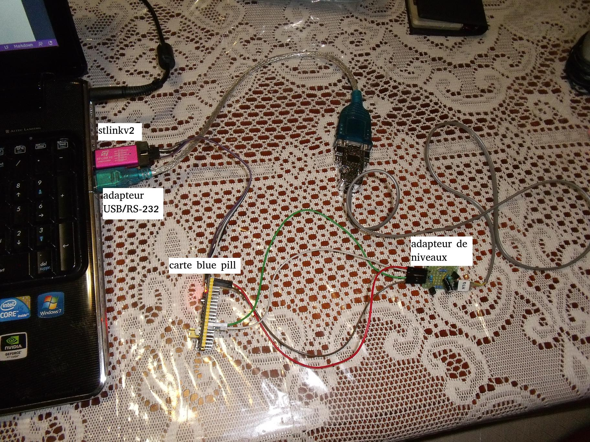
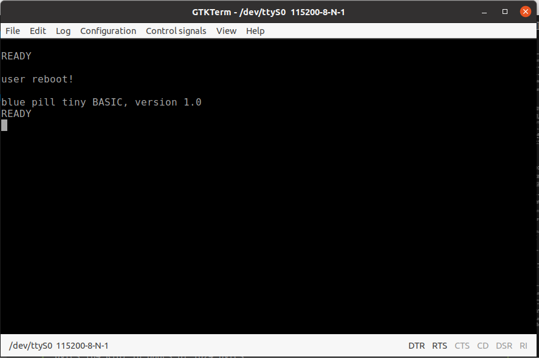

<!-- 
Copyright Jacques Deschênes, 2021
Ce document fait parti du projet stm32-tbi
https://github.com/picatout/stm32-tbi
-->

[-&gt;français](manuel_util_tb.md)
# Blue pill Tiny BASIC user manual

## index

* [Introduction](#intro)

* [Installation](#installation)

* [Use](#utilisation)

* [Command line](#cli)

* [Editor](#editeur)

* [Files](#fichiers)

* [File transfer](#send)

* [Programs examples](#exemples)

### Introduction 

[index](#index)

## Installation 

[index](#index)

## Use
 

[index](#index)

## Command line 
 

[index](#index)

## Editor

[index](#index)

## Files

[index](#index)

## File transfer

[index](#index)

## Programs examples

[top](#top)
