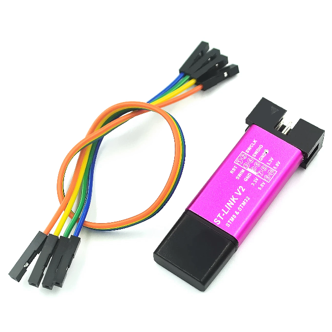
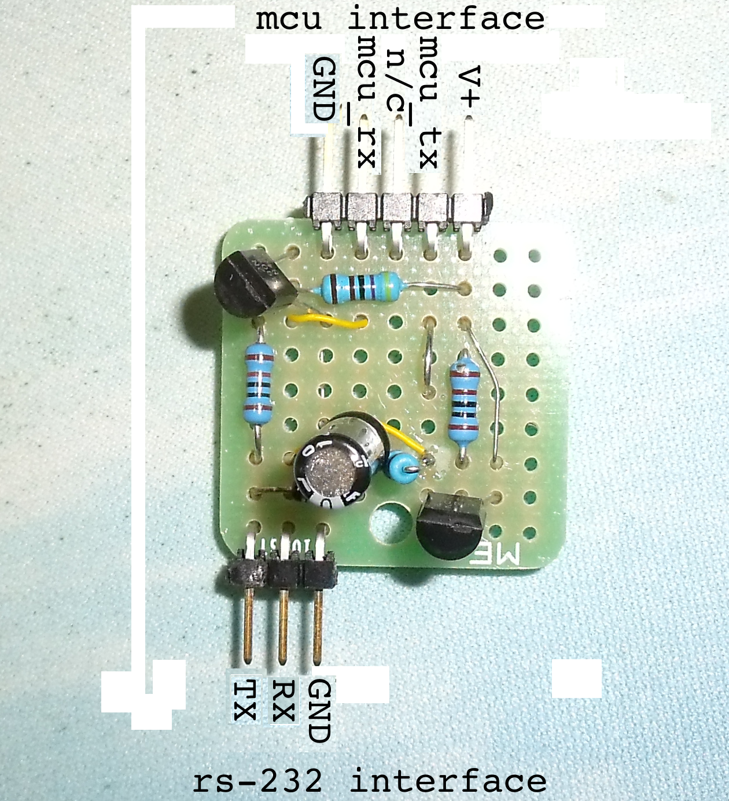
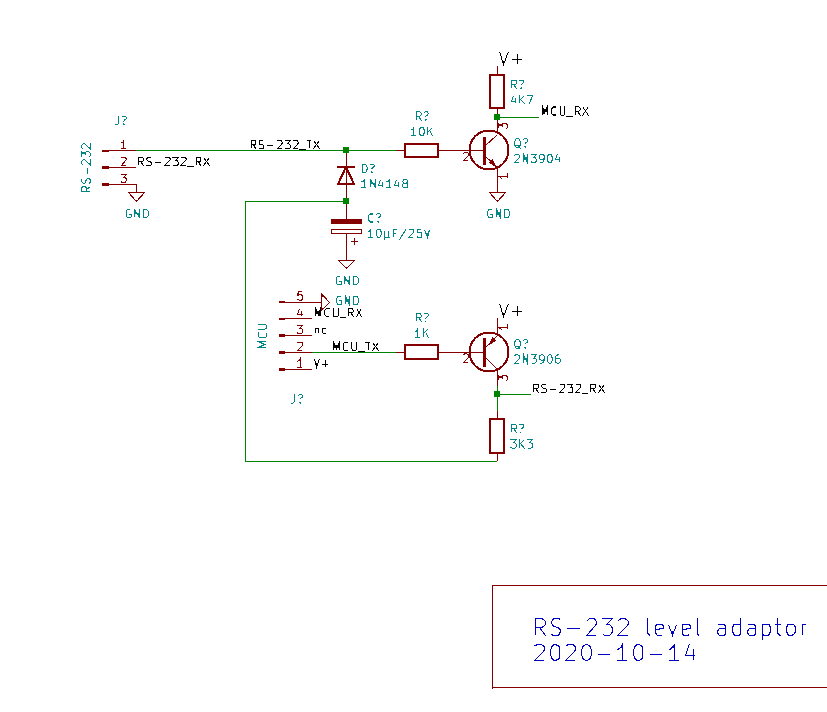
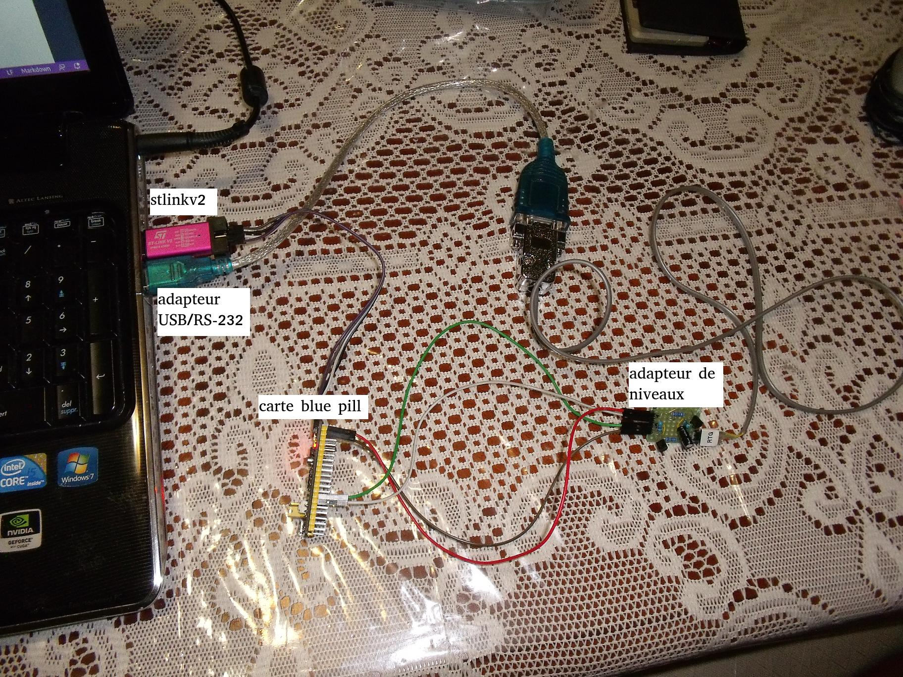

<!-- 
Copyright Jacques Deschênes, 2021
Ce document fait parti du projet stm32-tbi
https://github.com/picatout/stm32-tbi
-->
[-&gt;français](readme.md)
#  Blue pill Tiny BASIC 

This is an implementation of a BASIC stamp on blue pill board. This BASIC is based on original [tiny BASIC](https://en.wikipedia.org/wiki/Tiny_BASIC) but add extensions to it.  

* REPL interface on stamp, to make it interactive. 
* Editing source code facility and compiler on stamp. 
* Simple file system to save programs in FLASH memory.
* On PC require only a RS-232 serial port and VT100 terminal emulator to communicate with the **blue pill**.
* Support interrupt service routine written in BASIC.

## Required material

* blue pill board  .

* STLINK-V2 programmer  .

* RS-232 Level adapter  to interface with PC serial port. 
* On PC side any operating system with VT100 terminal emulator and serial port to connect to blue pill.

## Install blue pill tiny BASIC
Very simple. From root directory of project in bash shell type: **make build && make flash**. 
```
picatout:~/github/stm32-tbi$ make build && make flash
arm-none-eabi-as  -a=build/stm32-tbi.lst stm32-tbi.s -g -obuild/stm32-tbi.o 
arm-none-eabi-as  -a=build/terminal.lst terminal.s -g -obuild/terminal.o 
arm-none-eabi-as  -a=build/tinyBasic.lst tinyBasic.s -g -obuild/tinyBasic.o 
arm-none-eabi-ld -T stm32f103c8t6.ld  -g build/stm32-tbi.o build/terminal.o build/tinyBasic.o  -o build/stm32-tbi.elf
arm-none-eabi-objcopy -O binary build/stm32-tbi.elf build/stm32-tbi.bin 
arm-none-eabi-objdump -D build/stm32-tbi.elf > build/stm32-tbi.dasm
st-flash --serial=483f6e066772574857351967 erase 
st-flash 1.6.0
2021-03-14T11:15:56 INFO usb.c: -- exit_dfu_mode
2021-03-14T11:15:56 INFO common.c: Loading device parameters....
2021-03-14T11:15:56 INFO common.c: Device connected is: F1 Medium-density device, id 0x20036410
2021-03-14T11:15:56 INFO common.c: SRAM size: 0x5000 bytes (20 KiB), Flash: 0x10000 bytes (64 KiB) in pages of 1024 bytes
Mass erasing
st-flash  --serial=483f6e066772574857351967  write build/stm32-tbi.bin 0x8000000
st-flash 1.6.0
2021-03-14T11:15:56 INFO common.c: Loading device parameters....
2021-03-14T11:15:56 INFO common.c: Device connected is: F1 Medium-density device, id 0x20036410
2021-03-14T11:15:56 INFO common.c: SRAM size: 0x5000 bytes (20 KiB), Flash: 0x10000 bytes (64 KiB) in pages of 1024 bytes
2021-03-14T11:15:56 INFO common.c: Ignoring 1024 bytes of 0xff at end of file
2021-03-14T11:15:56 INFO common.c: Attempting to write 17408 (0x4400) bytes to stm32 address: 134217728 (0x8000000)
Flash page at addr: 0x08004000 erased
2021-03-14T11:15:57 INFO common.c: Finished erasing 17 pages of 1024 (0x400) bytes
2021-03-14T11:15:57 INFO common.c: Starting Flash write for VL/F0/F3/F1_XL core id
2021-03-14T11:15:57 INFO flash_loader.c: Successfully loaded flash loader in sram
 17/17 pages written
2021-03-14T11:15:58 INFO common.c: Starting verification of write complete
2021-03-14T11:15:58 INFO common.c: Flash written and verified! jolly good!
picatout:~/github/stm32-tbi$ 
```
If there is no error the blue pill card is ready to be used. Serial communication is via UART1.

* **A9** TX pin 
* **A10** RX pin 
* Any **G** pin for commun.

## A simple home made RS-232 level adaptor
* Adaptor schematic, simple and cheap.


* Assembly on 1" square perforated board.


* Connection to laptop.



