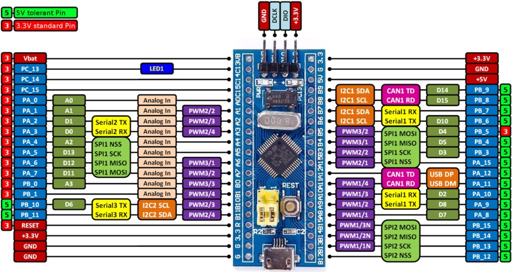
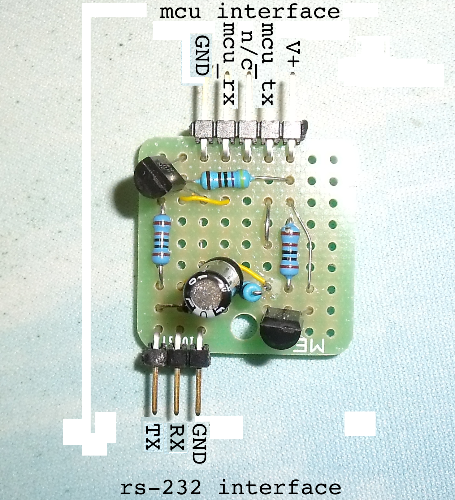
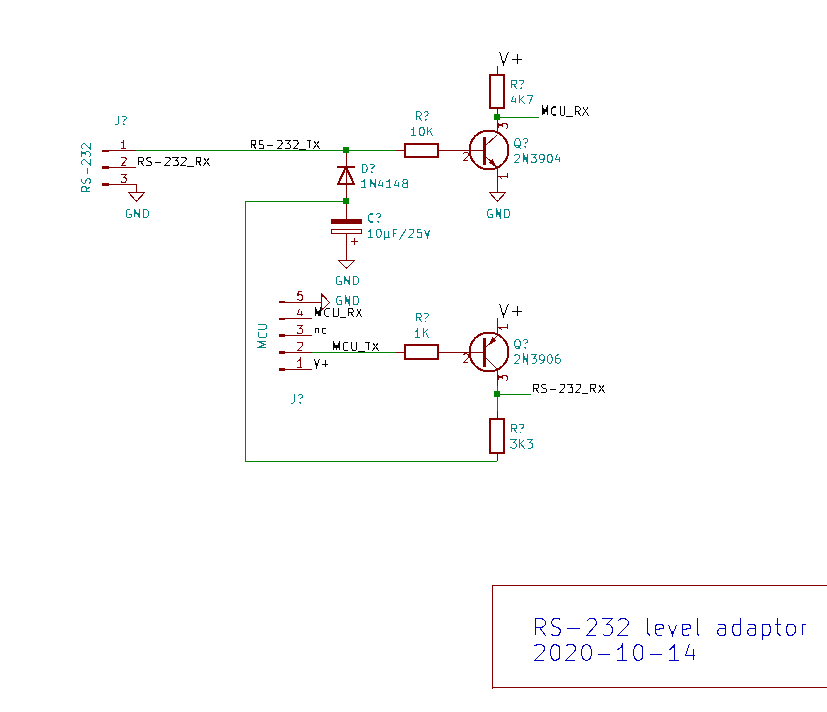

<!-- 
Copyright Jacques Deschênes, 2021
Ce document fait parti du projet stm32-tbi
https://github.com/picatout/stm32-tbi
-->
<a id="top"></a>
[-&GT;English](readme-en.md)
#  Blue pill Tiny BASIC 

Il s'agit de l'implémentation d'un timbre BASIC sur la carte blue pill. Ce BASIC est basé sur [tiny BASIC](https://en.wikipedia.org/wiki/Tiny_BASIC) mais avec des extensions.  

* Interface interactive via le terminal VT100. 
* Éditeur de texte et compilateur sur la carte. 
* Système de fichiers simple implémenté dans la mémoire FLASH excédentaire du MCU stm32f103 de la carte blue pill.
* Requière seulement un émulateur de terminal VT100 sur le PC et un port sériel rs-232 pour la communication avec la carte **blue pill** .
* Supporte les routines de service d'interruption écrites en BASIC.

## Documentation
* [manuel de référence tiny BASIC](docs/tbi_reference.md)
* [manuel de l'utilisateur](docs/manuel_util_tb.md)
## Matériel requis

* Carte blue pill .

* programmeur STLINK-V2 .

* Adapteur de niveaux RS-232  pour interfacer la carte au PC 

* Sur le PC un port sériel RS-232 et un émulateur de terminal VT100.

## Installation de Tiny BASIC sur la carte **blue pill**
À partir du répertoire racine du projet
. Lorsque la carte est branchée au programmeur STLINK-V2 et prête à être programmée faites la commande suivante: **make build && make flash**.
```
picatout:~/github/stm32-tbi$ make build && make flash
arm-none-eabi-as  -a=build/stm32-tbi.lst stm32-tbi.s -g -obuild/stm32-tbi.o 
arm-none-eabi-as  -a=build/terminal.lst terminal.s -g -obuild/terminal.o 
arm-none-eabi-as  -a=build/tinyBasic.lst tinyBasic.s -g -obuild/tinyBasic.o 
arm-none-eabi-ld -T stm32f103c8t6.ld  -g build/stm32-tbi.o build/terminal.o build/tinyBasic.o  -o build/stm32-tbi.elf
arm-none-eabi-objcopy -O binary build/stm32-tbi.elf build/stm32-tbi.bin 
arm-none-eabi-objdump -D build/stm32-tbi.elf > build/stm32-tbi.dasm
st-flash --serial=483f6e066772574857351967 erase 
st-flash 1.6.0
2021-03-14T11:15:56 INFO usb.c: -- exit_dfu_mode
2021-03-14T11:15:56 INFO common.c: Loading device parameters....
2021-03-14T11:15:56 INFO common.c: Device connected is: F1 Medium-density device, id 0x20036410
2021-03-14T11:15:56 INFO common.c: SRAM size: 0x5000 bytes (20 KiB), Flash: 0x10000 bytes (64 KiB) in pages of 1024 bytes
Mass erasing
st-flash  --serial=483f6e066772574857351967  write build/stm32-tbi.bin 0x8000000
st-flash 1.6.0
2021-03-14T11:15:56 INFO common.c: Loading device parameters....
2021-03-14T11:15:56 INFO common.c: Device connected is: F1 Medium-density device, id 0x20036410
2021-03-14T11:15:56 INFO common.c: SRAM size: 0x5000 bytes (20 KiB), Flash: 0x10000 bytes (64 KiB) in pages of 1024 bytes
2021-03-14T11:15:56 INFO common.c: Ignoring 1024 bytes of 0xff at end of file
2021-03-14T11:15:56 INFO common.c: Attempting to write 17408 (0x4400) bytes to stm32 address: 134217728 (0x8000000)
Flash page at addr: 0x08004000 erased
2021-03-14T11:15:57 INFO common.c: Finished erasing 17 pages of 1024 (0x400) bytes
2021-03-14T11:15:57 INFO common.c: Starting Flash write for VL/F0/F3/F1_XL core id
2021-03-14T11:15:57 INFO flash_loader.c: Successfully loaded flash loader in sram
 17/17 pages written
2021-03-14T11:15:58 INFO common.c: Starting verification of write complete
2021-03-14T11:15:58 INFO common.c: Flash written and verified! jolly good!
picatout:~/github/stm32-tbi$ 
```
Si tout se passe comme prévue le système **blue pill tiny BASIC** est maintenant installé sur la carte et prêt à l'utilisation.

La communication avec le PC se fait sur les broches

* **A9**&nbsp;&nbsp; Pour UART1 TX.
* **A10**&nbsp;&nbsp; Pour UART1 RX.
* N'importe quelle broche marquée **G** sur la carte pour le commun.

## Adapteur de niveau simple

* schématique d'un adapteur de niveau simple à réaliser et économique.


* Montage sur carte perforée de 1" carré.


* Utilisation avec le PC


<a id="sources"></a>
# code source 
Le code source est entièrement écris en assembleur et comprend les fichiers suivants.
* [stm32-tbi.s](../stm32-tbi.s)  Initialisation matérielle et interfaces de bas niveaux.
* [tinyBasic.s](../tinyBasic.s) L'interpréteur BASIC.
* [terminal.s](../terminal.s) Communication avec l'émulateur de terminal sur le PC.
* [stm32f103.inc](../stm32f103.inc) Définitions matérielles spécifiques au MCU de la carte **blue pill**. 
* [tbi_macros.inc](../tbi_macros.inc) Définitions de macros et constantes.
* [cmd_index.inc](../cmd_index.inc) Constantes associés aux jetons des commandes et fonctions. 
* [ascii.inc](../ascii.inc) Constantes du jeu de caractères ASCII.
* [stm32f103c8t6.ld](../stm32f103c8t6.ld) Script du linker.
* [Makefile](../Makefile) Script pour la commande make.

[début](#top)
